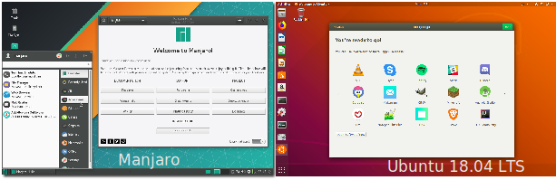

I replaced my windows machine with a Linux-only setup half a decade ago. Since then I never looked ever looked back and today I could not work productively without my tools.  As we motivate all of our junior developers to either chose Mac or Linux for their working environment, I often end up giving an introduction into my favorite tools and how to be productive. In this article, I want to share this for a basic development environment with Linux targeted at Linux-newcomers and junior devs.  This is not another awesome-Linux list sharing quadrillion tools.  I'm only listing the basic tools I use and think you want to consider when getting started.  

# Linux Distribution

**Ubuntu 18.04 Gnome**: Loved by few, used by the masses. Ubuntu is still my GoTo 
Linux distribution. Its pain-free to set up and use and mostly just works fine
out of the box. If you are new to Linux, use Ubuntu. 

----
**Manjaro**: The "new" cool kid and town. Manjaro combines the bleeding-edge attitude of Arch Linux with the user-friendliness of Ubuntu. Its rolling-release cycle ensures, that
your OS and your packages are almost always up to date. It's a sane alternative if ubuntu doesn't float your boat.
Ubuntus packages are sometimes quite outdated, this will never happen with Majaro.



# Basics

**Git**: 
Most used version control system today and a must have for any developer. Use with
github.com or gitlab.com for free remote repositories.

```$ sudo apt install git```

----

**GitKraken**: Using git from the command line is not for everyone. Gitkraken offers a very
nice and clean GUI to use git without a single command. It's free for non-commercial use. 

Download at: [www.gitkraken.com/download](https://www.gitkraken.com/download)

----

**Vagrant, VirtualBox**: Vagrant and Virtualbox are both used to spin up virtual machines. 
It's often important to test code across different platforms and nobody can carry around
a MacBook and windows laptop all the time. You can search for ready-to-use boxes at: 
https://app.vagrantup.com/boxes/search. 
 
```$ sudo apt install vagrant virtualbox ```

----
**Docker**: Docker is a tool to deploy and manage virtualized containers. Containers are another great way to spin up virtual environments also broadly used in deployments. 

```$ sudo apt install docker.io ```

----
**Chromium / Firefox**:
Choose the blue or the red pill ;). Both browsers are fine and have a powerful set of tools for your development.

```$ sudo apt install chromium-browser```

```$ sudo apt install firefox ```

----
**Inkscape, Gimp**
Every frontend needs some graphics or images. Inkscape is a powerful vector graphics program, while Gimp is an open source photoshop replacement. 

```$ sudo apt install Inkscape gimp ```

----
**Tmux**: This one is very important in my mind. Using Linux effectively means getting used to the command line. Tmux is a terminal multiplexer which allows you to manage several terminal
sessions and split the screen vertically and horizontally into several terminals.

```$ sudo apt install tmux ```


----

**Tmuxinator** (advanced): A tmux plugin enabling defining predefined terminal arrangements and autostart certain script and programs on launch.

```$ sudo apt install tmuxinator ```

----
# Editors / IDE

**MS Visual Studio Code**: Microsoft's free code editor is probably the most popular editor today.
Even Though I personally don't use it often, I recommend it for probably any programming task you might encounter. There is a strong community with plugins for almost any language. In doubt, 
just install visual studio code and start coding. 

- Downlaod at [https://code.visualstudio.com/download](https://code.visualstudio.com/download)

----
**Webstorm** (Javascript): Webstorm is a paid product by JetBrains. It's still my favorite editor for professional workloads but is a quite costly product. If you get started, please
start with a free editor first.

- Download at [https://www.jetbrains.com/webstorm/](https://www.jetbrains.com/webstorm)

----
**PyCharm** (Python): Also developed by JetBrains, but with a free community version. In my
mind the best Python development environment.

- Download at [https://www.jetbrains.com/pycharm/](https://www.jetbrains.com/pycharm/)

----
**Sublime**: Simple and fast Editor with a rich plugin system. Great for quick edits.

wget -qO - https://download.sublimetext.com/sublimehq-pub.gpg | sudo apt-key add -
sudo apt-get install apt-transport-https
echo "deb https://download.sublimetext.com/ apt/dev/" | sudo tee /etc/apt/sources.list.d/sublime-text.list
sudo apt-get update
sudo apt-get install sublime-text 
  

----
**Vim** (Advanced): Vim is still a quite popular editor for the command line. Vim is using its infamous keybindings, which seem impossible to learn on first sight. Vim is probably not a good choice for beginners. You need to overcome the initial frustrations
being quite slow for a while. I started to learn vim 3 times before I could finally sick to it. But - **IT IS WORTH IT**.
Once you are getting used to the key bindings, you want to use them everywhere, forever. 
It might be the last keybindings you have to learn forever. Every major Editor and IDE
has a plugin for vim keybindings. 

```$ sudo apt install vim```

----
**Vundle** (Advanced):  Vundle is a vim plugin manager. There are tons of plugins for vim for everything you might want to do with vim. 
Installation and usage via: [](https://github.com/VundleVim/Vundle.vim)
Some of my favorite plugins in my vimrc are


  Plugin 'scrooloose/nerdtree'
  Plugin 'scrooloose/syntastic'
  Plugin 'Chiel92/vim-autoformat'
  Plugin 'Yggdroot/indentLine'
  Plugin 'flazz/vim-colorschemes'
  Plugin 'bling/vim-airline' 
  Plugin 'christoomey/vim-system-copy' 
  Plugin 'davidhalter/jedi-vim' "autocompletion lib
  Plugin 'octol/vim-cpp-enhanced-highlight' " for c++
  Plugin 'pangloss/vim-javascript' " for javascript
  Plugin 'leafgarland/typescript-vim' " for typescript
  Plugin 'vim-python/python-syntax' " for python 
  

----
**Android Studio**: In case you want to develop apps for android you want to install android studio. Install via ubuntu software center or: 

```$ snap install android-studio```

----
# Languages: 

**Python**: Its pre-installed on most Linux distributions. Simple and powerful. 

----
**Nodejs**: Most used javascript engine with nodes package manager "npm".

```$ sudo apt install nodejs ```

----
**Go**: Google's programming language to build efficient software. 

```$ sudo apt install golang-go```

----
**Rust**: A system programming language similar to C++ with less pain.

```$ curl https://sh.rustup.rs -sSf | sh```

----
**Ruby**: Very common language used often in combination with rails to build backend applications. 

```$ sudo apt install ruby-full ```

----
**Java**: Still broadly used. If not pre-installed you can install open java runtime environment via:

```$ sudo apt install openjdk-8-jdk ```

----
# Databases: 

**MongoDB**: Most popular NoSQL 

```$ sudo apt-get install mongodb```

----
**Psql**: Very popular open source SQL 

```$ sudo apt-get install postgresql```

----
**Redis**: Very popular in-memory key-value database

```$ sudo apt-get install redis-server```

----
**Robo3T**: Also known as "robomongo". A nice MongoDB client GUI.
- Get it at https://robomongo.org/download

----
**DBeaver**: A database client GUI for most databases.
- Get it at https://dbeaver.io/

----
# Audio and Video editing: 

**VLC**: Simple and the only video player you will need. 

```$ sudo apt-get install vlc```

----
**SimpleScreenRecorder**: Videos often explain more than words. Helps you to record 
screen and microphone. 

```$ sudo apt-get install simplescreenrecorder```

----
**OBS**: Powerful software for video recording and live streaming.

```$ sudo add-apt-repository ppa:obsproject/obs-studio```

```$ sudo apt install obs-studio```

----
**OpenShot**: Simple video editor

```$ sudo add-apt-repository ppa:openshot.developers/ppa```

```$ sudo apt-get install openshot-qt```

----
**Audacity**: Simple audio editor

```$ sudo apt install audacity```

----
# Various Tools

**Wireshark**: Very powerful network analysis tool 

```$ sudo apt install wireshark```

----
**Dropbox**: Cloud-storage 
- install via https://www.dropbox.com/install-linux

----
**Lifera**: My favorite RSS reader

```$ sudo apt install liferea ```

----
**Htop**: beautiful process viewer

```$ sudo apt install htop```

----
**Pandoc**: A universal document converter for the command line. As an example, you can parse markdown to a pdf or a csv to an HTML. 
- Download at https://github.com/jgm/pandoc/releases

----
**Artillery** (nodejs): A simple load testing tool, to test your API with a defined number of requests.

```$ sudo npm install -global artillery ```
 
----
**Postman**: a great HTTP client to test your API manually 
- Get it via https://www.getpostman.com/

----
**Gnome extensions**: In case you use Gnome as your desktop environment (default for Ubuntu) 
you may install gnome extensions to extend gnomes functionality. I use:
- **Open Weather**: Displays the weather
  - [https://extensions.gnome.org/extension/750/openweather](https://extensions.gnome.org/extension/750/openweather)
- **Caffeine**: Keeps your screensaver off 
  - [https://extensions.gnome.org/extension/517/caffeine](https://extensions.gnome.org/extension/517/caffeine)
- **Window corner preview**: Previews a single window in the corner 
  - [https://extensions.gnome.org/extension/1227/window-corner-preview](https://extensions.gnome.org/extension/1227/window-corner-preview)

----
# Online-Services: 
- [**Slack.com**](https://slack.com): Nice, hackable communication platform for teams. Warning: Gets expensive with bigger teams. slack.com
- [**Trello.com**](https://dropbox.com): Collaboration and organization tool to plan projects and processes. 
- [**Draw.io**](https://draw.io): My favorite only tool for technical drawings. 
- [**Paletton.com**](https://paletton.com): Great tool to create color palettes.

# Fonts: 
I like nice fonts. It doesn't make you more productive, but maybe happier:

- **Source code pro** font: https://github.com/adobe-fonts/source-code-pro
- **Hack** font: https://github.com/source-foundry/Hack


Thats it! I hope you found a new tool for your toolbox. I like to read about other peoples 
setup, so keep me updated in case you write down your productive enviroment. 

